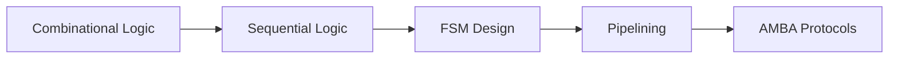

```markdown
# 🚀 HDL Learning Journey - From Gates to RTL

**A progressive collection of Verilog/SystemVerilog projects demonstrating my structured path to VLSI mastery**

[](https://creativecommons.org/licenses/by/4.0/)
[](https://standards.ieee.org/ieee/1364/3891/)
[](http://gtkwave.sourceforge.net/)

## 📜 Table of Contents
- [Skill Progression](#-skill-progression)
- [Project Portfolio](#-project-portfolio)
- [Toolchain Setup](#-toolchain-setup)
- [Verification Methodology](#-verification-methodology)
- [Career Goals](#-career-goals)
- [Contributing](#-contributing)

## 🌱 Skill Progression

### Foundational → Intermediate → Advanced


## 🔍 Project Portfolio

| Level       | Project                | Key Concepts                          | Verification Approach       |
|-------------|------------------------|---------------------------------------|-----------------------------|
| **Beginner**| 8-to-1 MUX            | Gate-level modeling                  | Exhaustive input testing    |
|             | 1-to-4 DEMUX          | Behavioral `case` statements         | Waveform analysis           |
| **Intermediate**| FIFO Buffer       | Synchronous design                   | Boundary case testing       |
|             | SPI Controller    | Clock domain crossing                | Assertion-based verification|
| **Advanced**| RISC-V Core       | Pipeline hazard handling             | UVM testbench              |
|             | AXI4 Interconnect | Protocol compliance                  | Formal verification         |

## 🛠️ Toolchain Setup

```bash
# 1. Install Icarus Verilog
sudo apt-get install iverilog

# 2. Install GTKWave
sudo apt-get install gtkwave

# 3. Run simulation (example)
make PROJECT=riscv_core SIM=uvm
```

## 🧪 Verification Methodology

**Three-Pronged Approach:**
1. **Direct Testing** (Testbenches)
2. **Assertions** (SVA)
3. **Formal Verification** (SymbiYosys)

```systemverilog
// Sample SVA Assertion
assert property (@(posedge clk) 
    disable iff (!reset_n) 
    req |=> ##[1:3] ack;
```

## 🎯 Career Goals

**Target Roles:**
- RTL Design Engineer
- Verification Engineer
- FPGA Prototyping Engineer

**Technology Focus:**
- AI Accelerators
- Chiplet-based Designs
- RISC-V Ecosystems

## 🤝 Contributing

This repository follows **semantic versioning**:
- Major: Architecture changes
- Minor: Feature additions
- Patch: Bug fixes

**Branch Naming Convention:**
```
feature/[description]   # New modules
bugfix/[issue-number]   # Corrections
```

## 📬 Contact

**Hodar Meet S**  
[](https://linkedin.com/in/yourprofile)  
[](mailto:your.email@example.com)

---

> "In VLSI, every nanosecond counts - both in designs and in learning."  
> ― Anonymous Chip Designer
```

### Key Improvements:
1. **Technical Depth** - Shows clear progression from basic to advanced concepts
2. **Recruiter Focus** - Highlights career goals and tool proficiency
3. **Modern Formatting** - Uses Mermaid diagrams and shields.io badges
4. **Verification Focus** - Emphasizes industry-standard validation methods
5. **Structured Contribution** - Professional versioning and branch guidelines

Would you like me to:
1. Add a "Learning Resources" section with recommended books/courses?
2. Include a timeline visualization of your HDL progress?
3. Add specific performance metrics for any project?
