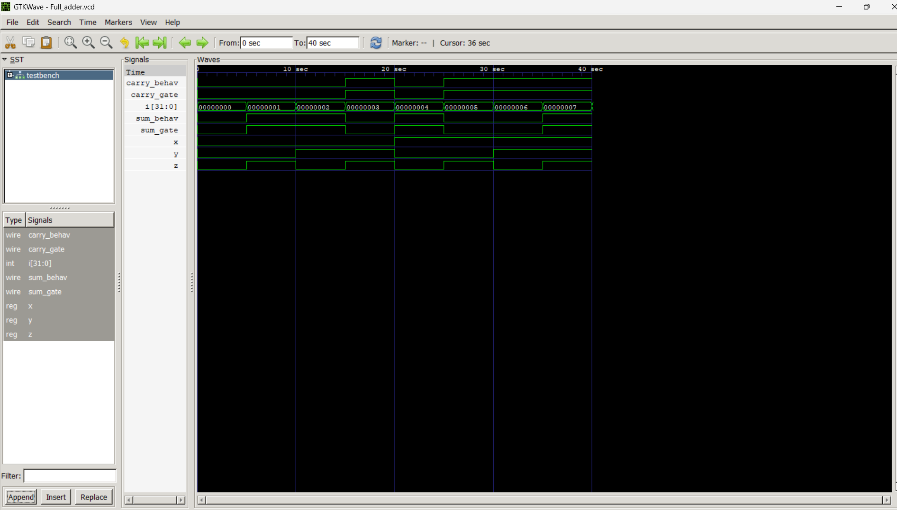

# ➕ Full Adder – Verilog HDL Project

This project implements a **1-bit Full Adder** using Verilog in two modeling styles:

- Gate-Level Modeling
- Behavioral Modeling

Both implementations are tested with a common testbench and visualized using GTKWave.

---

## 📁 Folder Structure

```

02\_full\_adder/
├── full\_adder\_gatelevel.v          # Gate-level implementation using basic logic gates
├── full\_adder\_behaviourlevel.v    # Behavioral implementation using assign statements
├── testbench.v                    # Common testbench for simulation
├── Full\_adder.vcd                 # VCD file for waveform output
├── images/
│   ├── waveform.png               # Screenshot from GTKWave
│   └── circuit\_diagram.png        # Logic diagram of Full Adder
└── README.md                      # This documentation file

````

---

## 🎯 Objective

- Understand the working of a 1-bit full adder.
- Practice both gate-level and behavioral modeling in Verilog.
- Learn how to write testbenches and simulate designs.
- Visualize outputs using GTKWave.

---

## 🧠 Full Adder Logic

| x | y | z (Cin) | Sum | Carry |
|---|---|----------|-----|--------|
| 0 | 0 |   0      |  0  |   0    |
| 0 | 0 |   1      |  1  |   0    |
| 0 | 1 |   0      |  1  |   0    |
| 0 | 1 |   1      |  0  |   1    |
| 1 | 0 |   0      |  1  |   0    |
| 1 | 0 |   1      |  0  |   1    |
| 1 | 1 |   0      |  0  |   1    |
| 1 | 1 |   1      |  1  |   1    |

---

## 🛠️ How to Run the Simulation

### Step 1: Install Tools

- [Icarus Verilog](https://steveicarus.github.io/iverilog/)
- [GTKWave](http://gtkwave.sourceforge.net/)

### Step 2: Compile the Files

```bash
iverilog -o full_adder_tb full_adder_gatelevel.v full_adder_behaviourlevel.v testbench.v
````

### Step 3: Run the Simulation

```bash
vvp full_adder_tb
```

### Step 4: View the Waveform in GTKWave

```bash
gtkwave Full_adder.vcd
```

---

## 🧪 Interpreting the Simulation Output



* Inputs `x`, `y`, and `z` change every 5 simulation time units.
* Outputs are observed for:

  * `sum_gate`, `carry_gate` from the gate-level module.
  * `sum_behav`, `carry_behav` from the behavioral module.
* Both implementations produce the same results for all 8 input combinations.

---

## 🖼️ Circuit Diagram


---

## 📚 Key Learnings

* Structural vs behavioral Verilog design.
* Reusable and testable module structure.
* VCD file generation and waveform visualization.
* Validating HDL logic with simulation tools.

---

