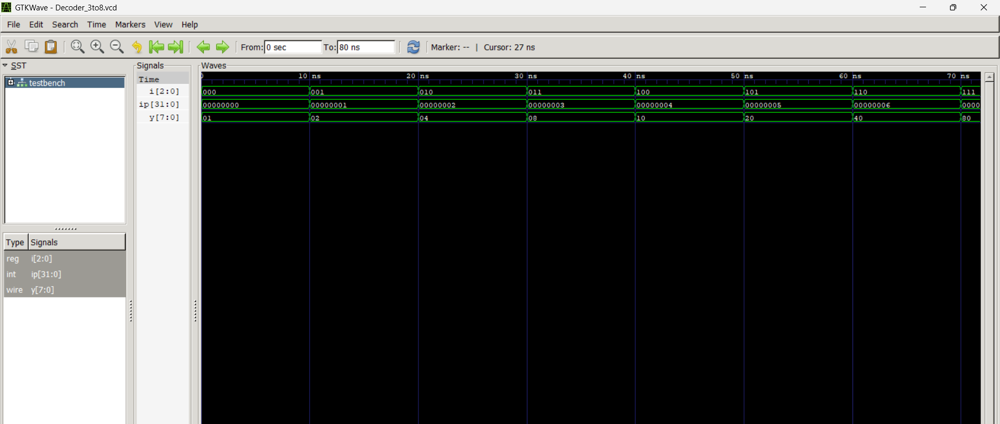

# 🔄 3-to-8 Decoder – Verilog HDL Project

This project implements a **3-to-8 Decoder** using **Behavioral Modeling** in Verilog. The decoder activates one of the eight outputs corresponding to a 3-bit binary input.

✅ A testbench exhaustively simulates all 8 input combinations and visualizes the results using **GTKWave**.

---

## 📁 Folder Structure

```

09\_3to8\_Decoder/
├── Decoder\_3to8\_behav.v         # Behavioral model of 3-to-8 Decoder
├── testbench.v                  # Testbench to simulate all 8 combinations
├── Decoder\_3to8.vcd             # Simulation waveform dump
├── images/
│   ├── Truth\_Table.png          # Visual truth table (placeholder)
│   └── Waveform.png             # GTKWave waveform screenshot
└── README.md                    # Project documentation (this file)

````

---

## 🧠 What is a 3-to-8 Decoder?

A **decoder** is a combinational circuit that converts binary information from *n input lines* to a maximum of *2ⁿ unique output lines*.

### 🔹 Functionality:
- Inputs: `i[2:0]` (3 bits)
- Outputs: `y[7:0]` (only one output high at a time)
- For input `i = n`, output `y[n] = 1` and all others are `0`.

---

## 📊 Truth Table

| i[2] | i[1] | i[0] | y[7:0]           |
|------|------|------|------------------|
|  0   |  0   |  0   | 00000001         |
|  0   |  0   |  1   | 00000010         |
|  0   |  1   |  0   | 00000100         |
|  0   |  1   |  1   | 00001000         |
|  1   |  0   |  0   | 00010000         |
|  1   |  0   |  1   | 00100000         |
|  1   |  1   |  0   | 01000000         |
|  1   |  1   |  1   | 10000000         |

🧠 Only one output is active (HIGH = `1`) at a time.

---

## 💻 Files Overview

### 🔸 `Decoder_3to8_behav.v`
- Uses `case` statement inside an `always @(*)` block.
- Initializes all outputs to `0` before decoding.
- Very readable and clean behavioral style.

### 🔸 `testbench.v`
- Loops through all `8` input combinations (0 to 7).
- Prints inputs and outputs using `$display`.
- Dumps waveforms to `.vcd` file for GTKWave.

---

## 📷 Output Previews

> 🖼️ **Truth Table Visual**
> 

> 🖼️ **Simulation Waveform**
> 

---

## 🛠️ How to Simulate

Make sure you have **Icarus Verilog** and **GTKWave** installed.

### 🔹 Compile
```bash
iverilog -o decoder_3to8.out Decoder_3to8_behav.v testbench.v
````

### 🔹 Run

```bash
vvp decoder_3to8.out
```

### 🔹 View in GTKWave

```bash
gtkwave Decoder_3to8.vcd
```

---

## 🧾 Output Sample

```
i[2]=0, i[1]=0, i[0]=0, y=00000001
i[2]=0, i[1]=0, i[0]=1, y=00000010
...
i[2]=1, i[1]=1, i[0]=1, y=10000000
```

---

## 📌 Concepts Used

* Behavioral Modeling in Verilog
* Case statement for clean decoding logic
* GTKWave visualization
* `for` loop in testbench
* `dumpvars` and `.vcd` usage

---

## 🚀 Project Status

✅ Completed
🧪 Fully tested
🖼️ Waveforms captured
📂 Pushed to GitHub

---

## 🔗 Repository

📂 **GitHub Repo**: [hdl-learning](https://github.com/CodeCommodoreMEET/hdl-learning)

---

## 👨‍💻 Author

**Meet Hodar**
📧 [hodarmeet99010@gmail.com](mailto:hodarmeet99010@gmail.com)
🔗 [LinkedIn](https://www.linkedin.com/in/hodar-meet-2200b1284)

---

