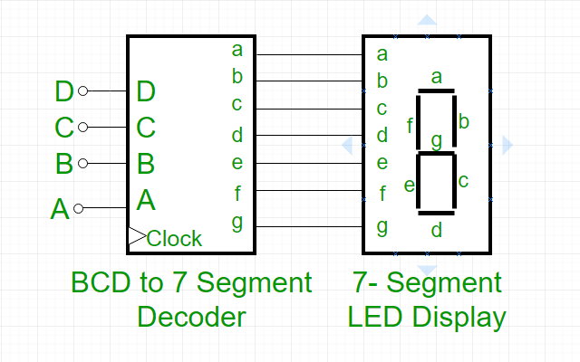
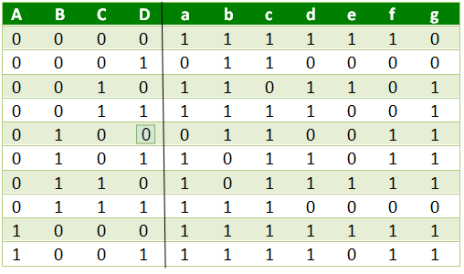

## BCD to 7-Segment Decoder

Welcome to the **BCD to 7-Segment Decoder** project! This captivating Verilog-based hardware design transforms Binary-Coded Decimal (BCD) inputs into signals that illuminate a 7-segment LED display, bringing digits to life in a visually stunning way. Whether you're just starting with digital design or an enthusiast eager to master Verilog, this project offers an exciting hands-on experience with real-world applications in digital electronics.

### Project Overview

A BCD to 7-Segment Decoder converts a 4-bit BCD input (representing digits 0–9) into the appropriate signals to drive a 7-segment LED display. Each segment (labeled `a` to `g`) is either turned on or off to form the corresponding digit. This project implements the decoder in Verilog, complete with a testbench to verify its functionality through simulation.

#### Block Diagram
The block diagram below illustrates the connection between the BCD to 7-Segment Decoder and the 7-segment LED display. The inputs `D`, `C`, `B`, and `A` represent the 4-bit BCD value, and the outputs `a` to `g` drive the segments of the display.



#### Truth Table
The truth table defines the output signals for each BCD input. A `1` indicates the segment is ON, and a `0` indicates it is OFF. This project assumes an **active-HIGH** output, meaning a `1` turns the segment on.



For invalid BCD inputs (10–15), all segments are turned off (`a = b = c = d = e = f = g = 0`).


**Note**: The logic symbol depicts an active-LOW output decoder (common for devices like the 7447 IC), but this project uses active-HIGH outputs to match the testbench output format.

### Features
- **Verilog Implementation**: The decoder is implemented in Verilog, making it easy to simulate and synthesize on FPGA hardware.
- **Comprehensive Testbench**: A testbench is provided to verify the decoder’s functionality for all 4-bit inputs (0–15), with clear output formatting.
- **Active-HIGH Outputs**: The decoder outputs `1` to turn on a segment, which is suitable for common-anode 7-segment displays (when interfaced appropriately).
- **Simulation Ready**: Use Icarus Verilog to compile and simulate the design, generating a VCD file for waveform analysis.

### Files
- **BCDto7-Segment_Decoder_behav.v**: The main Verilog module implementing the BCD to 7-Segment Decoder.
- **testbench.v**: The testbench to simulate the decoder and display the results.
- **BCDto7-Segment_Decoder.vcd**: The waveform file generated during simulation (after running the testbench).
- **images/**: Contains the following images:
  - `1221.png`: Truth table.
  - `ALL_POSSIBLE_Outputs.png`: Simulation output screenshot.
  - `bcd.png`: Block diagram.
  - `logic-symbol-for-a-BCD--to-seven-segment-decoder-driver-with-active-low-input.png`: Logic symbol.
  - `waveform.png`: Waveform screenshot from simulation.

### Getting Started

#### Prerequisites
- **Icarus Verilog**: Install Icarus Verilog to compile and simulate the Verilog code. Download it from [Icarus Verilog's official site](http://iverilog.icarus.com/).
- **Text Editor**: Use a text editor like VS Code, Notepad++, or any IDE that supports Verilog (e.g., Vivado, Quartus).

#### Steps to Run
1. **Clone or Download the Project**:
   Ensure you have the project files in your directory, including `BCDto7-Segment_Decoder_behav.v`, `testbench.v`, and the `images/` folder with the provided images.

2. **Navigate to the Project Directory**:
   Open a terminal or command prompt and navigate to the project directory:
   ```bash
   cd E:\Verilog\hdl-learning\basic_projects\14_BCDto7-Segment_Decoder
   ```

3. **Compile the Code**:
   Use Icarus Verilog to compile the Verilog files. Specify the testbench as the top-level module:
   ```bash
   iverilog -o BCDto7_Segment_Decoder_tb -s testbench BCDto7-Segment_Decoder_behav.v testbench.v
   ```

4. **Run the Simulation**:
   Execute the compiled simulation to see the output:
   ```bash
   vvp BCDto7_Segment_Decoder_tb
   ```

5. **View the Output**:
   The simulation will display a table showing the BCD input, the 7-segment outputs (`a` to `g`), and the corresponding decimal digit (0–9). Invalid BCD inputs (10–15) will show a blank in the "7-segment" column.

   
7. **Waveform Analysis**:
   Open the generated `BCDto7-Segment_Decoder.vcd` file in a waveform viewer like GTKWave to analyze the signals:
   ```bash
   gtkwave BCDto7-Segment_Decoder.vcd
   ```
 

### Verilog Code

#### BCDto7-Segment_Decoder_behav.v
This file contains the behavioral Verilog code for the BCD to 7-Segment Decoder.


#### testbench.v
This file contains the testbench to simulate and verify the decoder’s behavior.


### Learning Resources
To dive deeper into BCD to 7-Segment Decoders and Verilog, check out these resources on **GeeksforGeeks**:
- [BCD to 7 Segment Decoder](https://www.geeksforgeeks.org/bcd-to-7-segment-decoder/): A detailed explanation of the theory behind BCD to 7-segment conversion, including truth tables and logic design.
- [Verilog Tutorial](https://www.geeksforgeeks.org/verilog-hdl/): A beginner-friendly guide to learning Verilog, covering syntax, modules, and testbenches.
- [Digital Electronics Basics](https://www.geeksforgeeks.org/digital-electronics-logic-design-tutorials/): Explore the fundamentals of digital design, including decoders and display drivers.

### Future Enhancements
- **Adding a Clock Input**: Modify the decoder to use a clock signal for synchronous operation, as shown in the block diagram.
- **Support Active-LOW Outputs**: Adjust the decoder to support active-LOW outputs (as in the logic symbol) by inverting the logic.
- **FPGA Implementation**: Synthesize the design on an FPGA and connect it to a real 7-segment display for a hands-on experience.
- **Error Detection**: Add logic to detect and display an error symbol (e.g., "E") for invalid BCD inputs.

### Acknowledgments
- Inspired by digital electronics concepts from **GeeksforGeeks**.
- Thanks to the open-source community for tools like Icarus Verilog and GTKWave.

---

